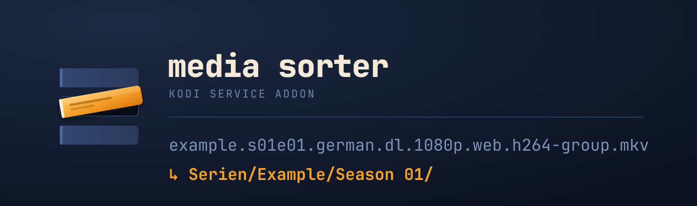

<p align="center">
  
</p>

# Media Sorter

A Kodi service add-on that files newly arrived movies and TV episodes into an
existing library structure, on its own.

Downloads land loose in the root of the media drive. The add-on works out what
they are and moves them where Kodi will find them:

```
example.s01e01.german.dl.1080p.web.h264-group.mkv
  ↳ Serien/Example/Season 01/

Example.Movie.2019.German.DL.1080p.BluRay.x264-GROUP/
  ↳ Movies/Example.Movie.2019.German.DL.1080p.BluRay.x264-GROUP/

Example.Show.S04.COMPLETE.German.DL.1080p.WEB.h264-GROUP/
  ↳ Serien/Example Show/Season 04/   (pack is broken open, episodes filed one by one)
```

Nothing is ever renamed, and nothing is ever overwritten.

## It knows when a file is still being unpacked

The hard part is not moving files, it is knowing when one is finished. While a
multi-part RAR archive is being extracted, the MKV is already visible but
incomplete — and it does not grow steadily. It sits still between archive parts.
A plain "unchanged for two minutes" check reports *done* at exactly the wrong
moment.

So the add-on reads the expected size straight out of the container header. An
MKV states the size of its segment in the first 64 bytes, which gives the exact
final size before a single percent has been written:

| File | Expected from header | Actual | Difference |
|---|---|---|---|
| Episode, 1080p WEB | 2,700,502,186 | 2,700,502,186 | 0 |
| Episode, 1080p WEB | 4,629,438,574 | 4,629,438,574 | 0 |
| Movie, 1080p WEB | 11,312,784,721 | 11,312,784,721 | 0 |

Four layers back this up, from exact to heuristic:

1. **Expected size from the header** — MKV via the EBML segment, AVI via RIFF
2. **RAR guard** — while `.rar`, `.r00` or `.partNN.rar` sit in the folder and
   were touched recently, the folder is left alone
3. **Extension filter** — `.part`, `.jdtmp`, `.!qB`, `.crdownload` and friends,
   anchored to the end of the name (otherwise `Example.Part.Two` counts as
   unfinished forever)
4. **Stability window** — size and mtime unchanged across several ticks

If an `.sfv` is present, every file it lists must exist as well.

## Title lookup without an API key

Turning `deep.signal.die.rueckkehr.s02e01` into
`Serien/Deep Signal/Season 02/` needs the real show title. The cascade runs
from strong to weak and stops as soon as it has an answer:

| Stage | Source | Network |
|---|---|---|
| 0 | Parent folder that carries a readable name | no |
| 1 | IMDb ID from the `.nfo` → TVmaze lookup | yes |
| 2 | Cache from earlier runs | no |
| 3 | Match against existing folders, exact or by abbreviation | no |
| 4 | TVmaze title search | yes |
| 5 | OpenSubtitles hash over the file contents | yes, with key |
| 6 | Queue, retried automatically | no |

**TVmaze needs no API key and no registration.** Only stage 5 wants a free
OpenSubtitles key; without one, that stage is skipped.

Stage 3 also resolves the short names release groups use, by testing whether the
abbreviation reads as a chain of word beginnings of a known title:

```
neohar → Neon Harbor          dee.si → Deep Signal
tso    → The Silent Order     palsu  → Palace of the Sun
nbs    → no match, that is a syllable abbreviation
```

It only accepts a single hit. With two candidates the file goes to the queue
rather than to the wrong place.

Stage 4 decides on name equality, not on score distance. Two shows sharing a
name — two seasons of the same franchise — cannot be told apart and are
rejected. A title that matches the search term exactly, against a
companion documentary with a longer name, can.

## The queue clears itself

Anything that cannot be placed stays put and is reassessed on every tick. When
a later episode arrives with a full name, the show folder appears — and the
previously unreadable short name finds it through stage 3 and gets filed after
the fact, with nobody doing anything. The same happens once an `.nfo` shows up.

## Installing

```bash
git clone https://github.com/willheisenberg/kodi-mediasorter.git
scp -r kodi-mediasorter/. root@YOUR-BOX:/storage/.kodi/addons/service.mediasorter/
```

Restart Kodi, then enable the add-on under *Add-ons → My add-ons → Services*.
Tested on LibreELEC 12.2.1 with Kodi 21 Omega.

**Dry run is on after installation.** The add-on only records what it would do
and touches nothing. Check `moves.log` in the add-on's profile folder to confirm
the target paths, then switch it live.

## Settings

| Setting | Default | What it does |
|---|---|---|
| Watched folder | `/var/media/MOVIES` | Where new arrivals land |
| Target for shows | `Serien` | Relative to the watched folder, or absolute |
| Target for movies | `Movies` | Relative to the watched folder, or absolute |
| Ignored folders | `Musik,Training,…` | Comma separated, skipped entirely |
| Log only | on | Dry run: writes to the log, moves nothing |
| Tick in seconds | 30 | How often the folder is checked |
| Stable ticks until done | 2 | Layer 4 of the readiness check |
| Quiet time after RAR change | 120 | Layer 2, in seconds |
| Notifications | on | Kodi toast after filing |
| Update library | on | Targeted scan of the destination path only |
| OpenSubtitles API key | empty | Optional, unlocks stage 5 |

Target paths may be relative or absolute, but they have to sit on the same drive
as the watched folder. The reason: moving is done purely with `os.rename`, which
is atomic and takes milliseconds. Crossing drives would mean copying, and a
copy running for minutes would need locking, a worker thread and cleanup logic
for aborted transfers. If a target is on another drive, the add-on stays idle
and says exactly that.

## What it will not do

- **Never overwrites.** If the destination file exists, it is left untouched and
  the new arrival goes to the queue.
- **Never renames.** File and folder names stay exactly as they are.
- **Never deletes** — with one exception: a pack folder that is completely empty
  after being broken open. If any extras remain inside, it stays.
- **Never touches what is playing.** If Kodi is playing the file, that tick
  skips it.
- **Folders without a video file are not candidates.** A folder of holiday
  photos will not end up in `Movies/`.

Every move is recorded in `moves.log` with a timestamp, source and destination,
so any step can be undone by hand.

## Development

```bash
python3 -m pytest          # 165 tests, all offline
```

The suite blocks HTTP calls globally; tests that genuinely need the network
carry the `@pytest.mark.netzwerk` marker. The integration test rebuilds a
realistic directory tree as zero-byte stand-ins and runs the tick against it.

Kodi is touched only by `service.py`, `config.py` and `library.py`, and there
only inside functions. The remaining eight modules are plain Python and import
without Kodi running — which is why all of the logic is testable.

```
service.py        Kodi loop, ticker
resources/lib/
  durchlauf.py    one tick: scan, check, resolve, plan, move
  readiness.py    the four layers of the readiness check
  parser.py       name → type, title, season, episode, year
  resolver.py     title → target folder, the six-stage cascade
  planner.py      target paths, breaking open season packs
  mover.py        os.rename, collision guard, log
  pending.py      queue with automatic retry
  scanner.py      finding candidates
  config.py       settings and path validation
  library.py      Kodi JSON-RPC
  log.py          logging, free of Kodi
```

Identifiers and module names are German, matching the add-on's settings labels.

## License

MIT
